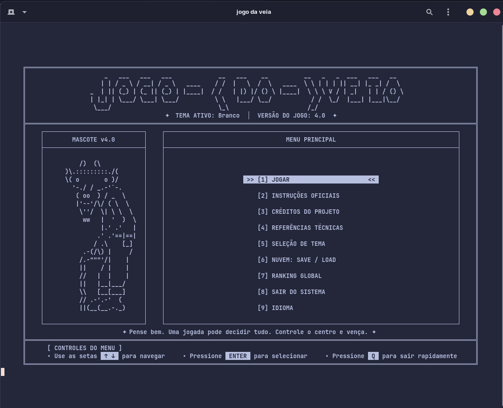
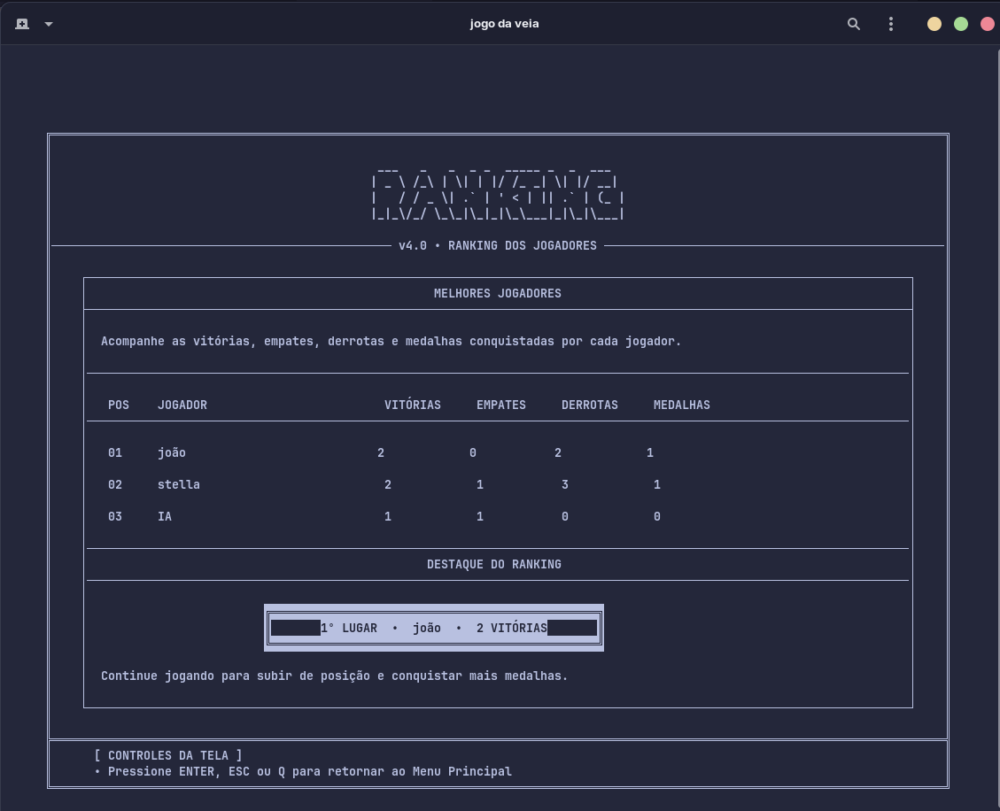
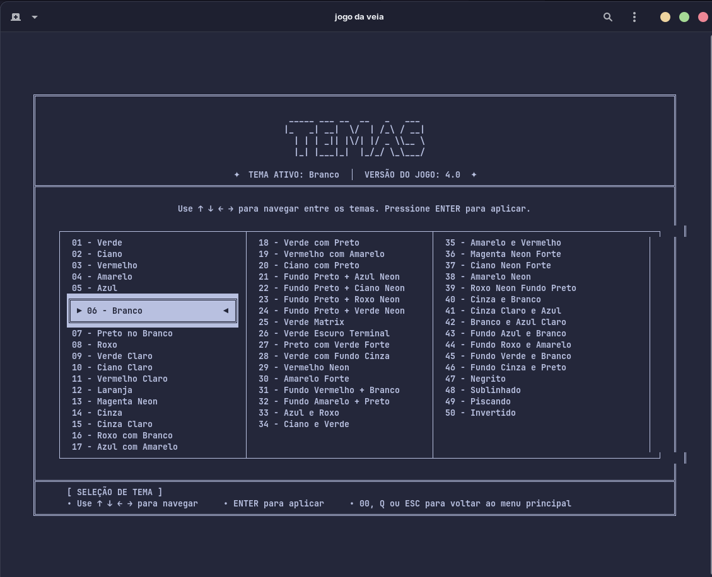
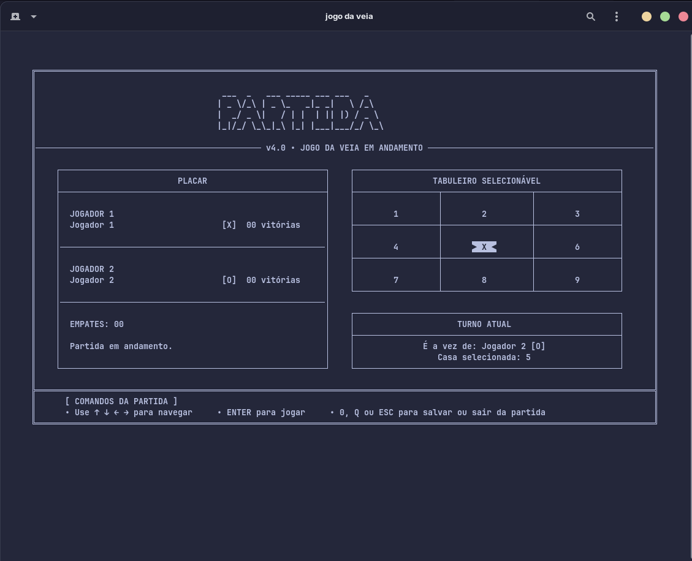

<h1 align="center">
       Jogo da Veia em C
    <br />
    <br />
    <a href="https://github.com/StellaKarolinaNunes/jogo-da-veia">
     
    </a>
  </h1>

</div>

<p align="center">
  
  
  <a href="https://github.com/StellaKarolinaNunes/lipo-docs-mintlify/blob/main/LICENSE"></a>
</p>

<br>

---

## Introdução

Este projeto foi desenvolvido durante o segundo semestre da faculdade como parte
da disciplina de Programação 1. O objetivo foi consolidar e ampliar os conceitos
de programação aprendidos até o momento, por meio da criação de um jogo da veia
utilizando a linguagem C.

---

## Qual o Problema?

Desenvolver um jogo interativo em linguagem C como projeto prático da disciplina
de Programação 1, com o objetivo de aplicar e reforçar os conceitos fundamentais
estudados ao longo das aulas.

A proposta consiste na criação de um jogo simples baseado em turnos, como o jogo
da veia, utilizando conceitos essenciais de programação, tais como:

- Entrada e validação de dados do usuário
- Estruturas de controle de fluxo (if, while, for)
- Modularização por meio de funções
- Manipulação de arrays *e entre outras funções

<br>

## A Solução

A solução desenvolvida utiliza uma matriz 3x3 de caracteres para representar o
tabuleiro do jogo. O sistema foi estruturado de forma modular, com funções
específicas responsáveis por:

- Exibir o tabuleiro
- Validar as jogadas dos jogadores
- Controlar os turnos
- Verificar condições de vitória ou empate

O fluxo principal do programa utiliza estruturas de repetição para alternar os
turnos entre os jogadores até que uma condição de término seja atingida. Dessa
forma, o jogo proporciona uma experiência interativa, organizada e eficiente,
aplicando na prática os principais conceitos da linguagem C.

<br>

## Funcionalidades

- **Múltiplos Modos de Jogo**:
  - **Player vs Player**: Desafie um amigo localmente.
  - **Player vs IA**: Enfrente a inteligência artificial com 3 níveis de
    dificuldade (Fácil, Médio, Difícil).
  - **Modo Infinito**: Uma variação dinâmica onde as peças mais antigas
    desaparecem após 3 jogadas, forçando novas estratégias.
- **Personalização Estética**:
  - Mais de 50 temas visuais diferentes aplicáveis em tempo real.
  - Cabeçalhos em ASCII Art dinâmicos e vibrantes.
- **Competição e Progressão**:
  - **Ranking Global**: Acompanhe vitórias, derrotas, empates e saldo de pontos.
  - **Sistema de Medalhas**: Conquiste medalhas por feitos específicos (ex:
    vencer a IA no nível difícil).
- **Gestão de Partidas**:
  - **Save/Load**: Salve o estado da sua partida
  - **Replay**: Assista à repetição automática da última partida jogada.
- **Modo Torneio**: Configure partidas "Melhor de 3" ou "Melhor de 5".
- **Interface Refinada**: Layout fixo de 102 colunas com centralização dinâmica
  de textos e feedback de status integrado.

> **Fluxograma do Projeto**: Caso queira entender a lógica de navegação e
> processos do aplicativo, acesse o arquivo
> [fluxograma/FLUXOGRAMA.md](fluxograma/FLUXOGRAMA.md).

<br>

## Layout da Aplicação

<p align="center">
  
  
</p>

<p align="center">
  
  
</p>

<br>

## Estrutura de Pastas

A estrutura do projeto segue o padrão de organização por camadas, facilitando a
manutenção e escalabilidade.

```bash
jogo_veia/
├── assets              # Imagens e banners do projeto
├── build               # Arquivos gerados pela compilação
├── compile.sh          # Script de compilação
├── config.h            # Configurações do projeto
├── CONTRIBUTING.md    # Contribuições
├── Doxyfile            # Documentação do projeto
├── file_manager.c      # Gerenciamento de arquivos
├── file_manager.h      # Gerenciamento de arquivos
├── fluxograma          # Fluxogramas do projeto
├── game.c              # Lógica do jogo
├── game.h              # Lógica do jogo
├── globals.c           # Variáveis globais
├── i18n.c              # Internacionalização
├── i18n.h              # Internacionalização
├── LICENSE             # Licença do projeto
├── main.c              # Função principal
├── menu.c              # Menu do jogo
├── menu.h              # Menu do jogo
├── ranking.dat         # Ranking de jogadores
├── README.md           # README do projeto
├── ROADMAP.md          # Roadmap do projeto
├── saves               # Arquivos de saves
├── settings.cfg        # Configurações do jogo
├── theme.c             # Temas do jogo
├── theme.h             # Temas do jogo
├── themes.cfg          # Temas do jogo
├── ui.c                # Interface do jogo
├── ui.h                # Interface do jogo
├── utils.c             # Utilitários
└── utils.h             # Utilitários
```

<br>

### Manutenibilidade e Compatibilidade

- **Problema:** Incompatibilidade de nomes de arquivos entre Windows e Linux
  (Case Sensitivity).
- **Causa:** O desenvolvedor original utilizou CamelCase em alguns locais e
  lower_case em outros, o que causava erros de compilação em sistemas Linux.
- **Solução:** Padronização rigorosa para `lower_case` em todos os arquivos
  fonte (.c) e cabeçalhos (.h).
- **Problema:** Tabuleiro desalinhado após a aplicação de temas coloridos.
- **Causa:** Os códigos de escape ANSI possuem largura zero no terminal, mas
  ocupam espaço na contagem de strings do C.
- **Solução:** Implementação de uma largura fixa para cada célula do tabuleiro,
  independente da presença de cores.
- **Problema:** A IA era previsível e permitia vitórias fáceis.
- **Causa:** Algoritmo baseado apenas em condições `if/else` superficiais.
- **Solução:** Introdução do algoritmo **Minimax** para a dificuldade "Difícil",
  tornando-a imbatível matematicamente através da exploração de todas as
  possibilidades de jogo.

<br>

## Instalação

### Pré-requisitos para Rodar jogo da veia na sua maquina

- **Compilador C**: Recomendado [GCC](https://gcc.gnu.org/) (versão 9.0 ou
  superior).
- **Bash Environment**: O script de automação `./compile.sh` requer um ambiente
  shell (Nativo no Linux/macOS, Git Bash no Windows).
- **Terminal**: Suporte a sequências de escape ANSI (Cores e formatação) para a
  experiência visual completa.
- **Git**: Para clonar o repositório.
- **gcc (compilador C)**: Para compilar o projeto.
- **make (automação)**: Para automatizar a compilação.

<br>

### Tecnologias utilizadas

- **C**: Linguagem de programação utilizada.
- **Bash**: Script de automação.
- **Git**: Controle de versão.

<br>

### Instalação Rápida

#### 1. Clone o repositório

```bash
git clone https://github.com/StellaKarolina/jogo_ veia.git
```

#### 2. Acesse pasta

```bash
cd jogo_ veia
```

#### 3. Compile o código Usando o Script de Compilação (Recomendado)

```bash
chmod +x compile.sh    # Dá permissão de execução (se necessário)
./compile.sh           # Compila e inicia o jogo
```

#### 4. Manualmente via Terminal (Caso queira saber o comando exato)

```bash
gcc *.c -o jogo_ veia   # Compila o projeto
./jogo_ veia            # Executa o projeto
```

### 5. Scripts Disponíveis

- `./compile.sh` Compila o projeto
- `./run.sh` Executa o projeto
- `./clean.sh` Limpa o projeto

<br>

> Saiba mais sobre a linguagem C (so click no texto desejado):
> [COMO INSTALAR C WINDOWS](https://www-digitalocean-com.translate.goog/community/tutorials/c-compiler-windows-gcc?_x_tr_sl=en&_x_tr_tl=es&_x_tr_hl=es&_x_tr_pto=tc&_x_tr_hist=true);
> [COMO INSTALAR C LINUX](https://www.bosontreinamentos.com.br/linux/como-instalar-gcc-e-pacotes-de-desenvolvimento-no-linux-debian-10/);
> [Documentação](https://port70.net/~nsz/c/c11/n1570.html);
> [Documentação ISO C Draft](https://www.open-std.org/jtc1/sc22/wg14/www/docs/n2310.pdf);
> [Guia](https://www.geeksforgeeks.org/c-programming-language/);
> [Referência](https://en.cppreference.com/w/c/language.html);

<br>

## Roadmap

Atualmente, o **Jogo da Veia v4.0** está em evolução. As próximas etapas estão
organizadas por áreas de desenvolvimento.

### Inteligência Artificial

- [ ] **IA Mestre com Minimax:** implementar o algoritmo Minimax com poda
      Alfa-Beta para criar uma IA de alta dificuldade.
- [ ] **Dificuldade IA Adaptável:** criar uma IA que ajuste sua estratégia de
      acordo com a taxa de vitória e desempenho do jogador.
- [ ] **Modo Impossível:** desenvolver uma IA com estratégia ótima, capaz de
      evitar derrotas no tabuleiro clássico 3x3.

### Multiplayer e Rede

- [ ] **Multiplayer via Rede Local (LAN):** usar sockets TCP/IP em C para
      permitir partidas entre dois jogadores em máquinas diferentes.
- [ ] **Modo Espectador:** permitir que outros usuários se conectem à porta da
      partida apenas para assistir ao jogo.
- [ ] **Leaderboard Global:** conectar o ranking local a uma API externa, criada
      em Node.js ou Python, utilizando cURL em C para enviar e consultar
      recordes globais.

### Novos Modos de Jogo

- [ ] **Tabuleiros Dinâmicos:** oferecer suporte para matrizes maiores, como
      4x4, 5x5 ou até 10x10.
- [ ] **Modo Gomoku:** em tabuleiros maiores, vencer ao alinhar cinco peças.
- [ ] **Modo Misère:** versão reversa do Jogo da Velha, na qual quem alinhar
      três peças perde.
- [ ] **Modo Quântico:** implementar uma versão inspirada em _Quantum
      Tic-Tac-Toe_, com jogadas em superposição até ocorrer um colapso.
- [ ] **Modo Nevoeiro:** esconder partes do tabuleiro ou fazer algumas casas
      desaparecerem após determinadas rodadas.

### Perfis e Progressão

- [ ] **Contas e Perfis de Usuário:** criar uma tela de login local em que cada
      perfil guarde vitórias, derrotas, empates, tempo de jogo e histórico de
      partidas.
- [ ] **Sistema de Conquistas:** implementar medalhas e objetivos especiais para
      incentivar novas partidas.

  - [ ] **Intocável:** vencer a IA no modo Difícil sem sofrer ameaça de derrota.
  - [ ] **Maratonista:** jogar mais de 20 partidas seguidas.
  - [ ] **Pacifista:** conquistar 10 empates seguidos contra a IA.
- [ ] **Desbloqueio de Cosméticos:** liberar novos temas de terminal e símbolos
      personalizados, como `♠`, `♥`, `★` ou `◆`, ao cumprir conquistas.

### Experiência Visual e Áudio

- [ ] **Animações no Terminal:** adicionar transições suaves, efeitos de
      entrada, _fade-in_ e peças “caindo” no tabuleiro usando delays em
      milissegundos e códigos ANSI.
- [ ] **Áudio no Terminal:** reproduzir bipes, efeitos sonoros ou arquivos
      `.wav` curtos durante jogadas, vitórias e navegação pelos menus.
- [ ] **Suporte a Mouse no Terminal:** usar `ncurses` ou sequências de terminal
      para permitir selecionar casas do tabuleiro com cliques do mouse.

### Melhorias Técnicas Futuras

- [ ] **Sistema de Configurações:** permitir alterar idioma, tema, sons,
      animações, estilo do tabuleiro e dificuldade padrão.
- [ ] **Histórico de Partidas:** registrar partidas anteriores com data,
      jogadores, modo escolhido, vencedor e duração.
- [ ] **Exportação de Dados:** permitir exportar ranking, histórico e
      estatísticas em arquivos `.txt`, `.csv` ou `.json`.
- [ ] **Sistema de Backup:** criar cópias automáticas dos salvamentos para
      evitar perda de progresso.
- [ ] **Compatibilidade Multiplataforma:** garantir funcionamento adequado em
      Linux, Windows e outros terminais compatíveis.

<br>

## Contribuição

Contribuições são o que tornam a comunidade de código aberto um lugar incrível
para aprender, inspirar e criar. Qualquer contribuição que você fizer será
**muito apreciada**.

Para saber como colaborar, por favor leia o nosso
[Guia de Contribuição](CONTRIBUTING.md).

### Resumo do Processo:

1. Faça um Fork do projeto
2. Crie sua Branch de Funcionalidade
   (`git checkout -b feature/NovaFuncionalidade`)
3. Faça o Commit de suas alterações
   (`git commit -m 'Adiciona uma Nova Funcionalidade'`)
4. Faça o Push para a Branch (`git push origin feature/NovaFuncionalidade`)
5. Abra um Pull Request

<br>

### Diretrizes

- Código limpo e bem comentado
- Mensagens de commit claras e objetivas
- Teste todas as funcionalidades
- Mantenha a documentação atualizada
- Siga os padrões de código existentes

<br>

## Licença

Este projeto está licenciado sob a [Licença MIT](LICENSE).

```bash
MIT License - você pode usar, modificar e distribuir livremente,
mantendo a referência ao repositório original.
```

<br>

## Créditos

O **Jogo da Veia** é construído com o apoio de tecnologias e comunidades
incríveis:

- **Linguagem:** [C (Padrão ISO C11)](https://en.cppreference.com/w/c/11)
- **Compilador:** [GCC](https://gcc.gnu.org/)
- **Interface:**
  [ANSI Escape Codes](https://en.wikipedia.org/wiki/ANSI_escape_code) (Cores e
  Formatação)
- **ASCII Art:** [FIGlet / TAAG](https://patorjk.com/software/taag/)
- **Documentação:** [Doxygen](https://www.doxygen.nl/)
- **Professor Orientador:**
  [Douglas Bechara Santos](https://github.com/douglasbechara)
- **Instituição:** [IFPA CAMPUS - TUCURUÍ] - Curso de Ciência da Computação

<br>

### Desenvolvimento Principal

<table>
  <tr>
    <td align="center">
      <a href="https://github.com/StellaKarolinaNunes">
        
        <br />
        <sub><b>Stella Karolina (Desenvolvedora)</b></sub>
        <br />
      </a>
    </td>
  </tr>
</table>
